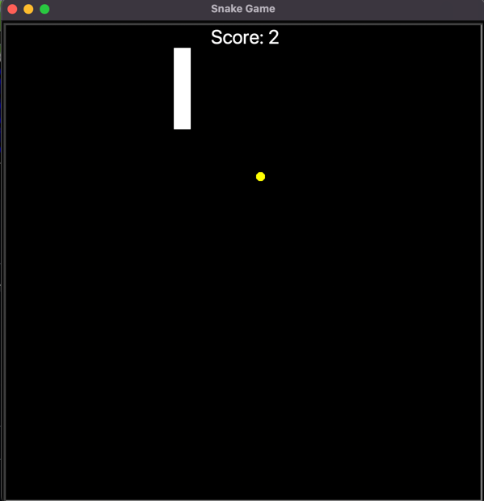

# Snake Game
The nostalgic snake game created using python turtle package. 

## Gameplay
The game spawns a snake and food particle.
The player can control the snake's movements and attempt to eat the food particle by running towards it. 
Once the food particle is consumed, another food spawns somewhere in the screen. The score is incremented
based on the snake consuming food. Each consumption increases the snake's length by one unit.  
Keys to control the snake:
 - Up
 - Down
 - Left
 - Right

Colliding with the walls will instantly kill the snake and score will be reset to zero. Collision with snake's
own body or tail will reset the game.

## Acknowledgement 
This game was written with guidance from https://www.udemy.com/course/100-days-of-code/ in my 100 Days of Code challenge.
